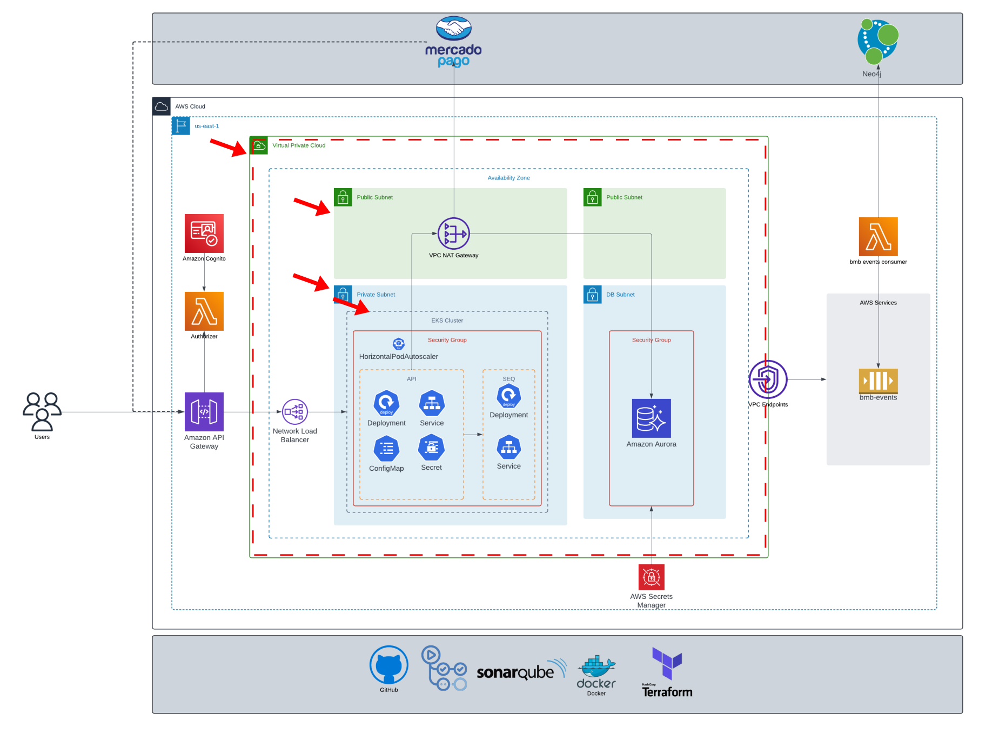

# bmb.infra
[](https://github.com/soat-fiap/bmb.infra/actions/workflows/terraform.yml)

## Overview
This repository contains Terraform configurations to set up a Virtual Private Cloud (VPC) and an Elastic Kubernetes Service (EKS) cluster on AWS. These components form the core elements of the infrastructure, providing a scalable and secure environment for deploying containerized applications.

## Architecture
The architecture consists of the following components:
- **VPC (Virtual Private Cloud)**: A logically isolated network that provides the foundation for the AWS infrastructure.
- **Subnets**: Public and private subnets spread across multiple Availability Zones for high availability.
- **Internet Gateway**: Allows communication between the VPC and the internet.
- **NAT Gateway**: Enables instances in private subnets to connect to the internet while remaining unreachable from the outside.
- **EKS Cluster (Elastic Kubernetes Service)**: A managed Kubernetes service that simplifies running Kubernetes on AWS without needing to install and operate your own Kubernetes control plane or nodes.
- **Worker Nodes**: EC2 instances that run your containerized applications.

## Resources Created
- **VPC (Virtual Private Cloud)**: A logically isolated network that provides the foundation for the AWS infrastructure.
- **EKS Cluster (Elastic Kubernetes Service)**: A managed Kubernetes service that simplifies running Kubernetes on AWS without needing to install and operate your own Kubernetes control plane or nodes.

## Prerequisites
- Terraform installed on your local machine.
- AWS CLI configured with appropriate credentials.
- An AWS account with necessary permissions to create VPC and EKS resources.

## Usage
1. Clone the repository.
2. Navigate to the directory containing the Terraform files.
3. Initialize Terraform:
    ```sh
    terraform init
    ```
4. Apply the Terraform configuration:
    ```sh
    terraform apply
    ```

## Outputs
- **VPC ID**: The ID of the created VPC.
- **EKS Cluster Name**: The name of the created EKS cluster.
- **EKS Cluster Endpoint**: The endpoint URL for the EKS cluster.

## Notes
- Ensure that the AWS region specified in the Terraform configuration matches your desired deployment region.
- Review and customize the Terraform variables as needed to fit your specific requirements.

## License
This project is licensed under the MIT License. See the LICENSE file for more details.

## This repo on the infrastructure


